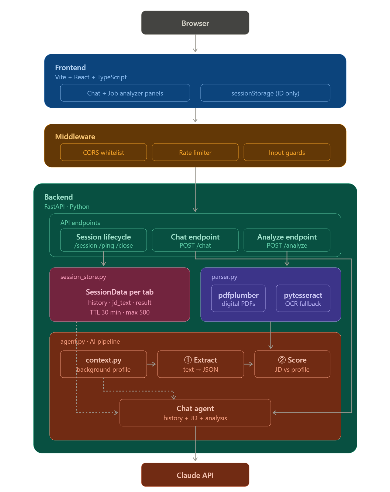

# Technical Architecture Overview

## Diagram

---

## Explanation

The application is a full-stack AI agent with two capabilities in a single interface: a chat where you can ask questions about my background and experience, and a job fit analyzer where you upload a job description and get a match score with a breakdown.

### Frontend

The frontend is a React + TypeScript SPA built with Vite. It has two panels side by side, the chat on the left and the job analyzer on the right. The session ID is stored in `sessionStorage`, which means it is scoped to the tab. If you close the tab or open a new one, you get a fresh session and everything is gone: history, uploaded JD, score. That is intentional since this is a demo and I did not want to persist anything.

To keep the session alive while the tab is open, the frontend sends a heartbeat to the backend every 4 minutes. When the tab closes, it fires a `sendBeacon` request to delete the session immediately on the server. `sendBeacon` is the right tool here because it is guaranteed to complete even as the browser is closing, unlike a regular `fetch`.

The score visualization is a custom animated SVG ring with no charting library. It animates from 0 to the actual score on mount using a CSS `stroke-dashoffset` transition, with color-coded rings (green, blue, amber, red) depending on the result.

### Backend

The backend is FastAPI. Every request goes through three layers before hitting any logic: CORS locked to the configured frontend origin, IP-based rate limiting (10 req/min on chat, 3 on analyze), and input guards that enforce a 5 MB file cap, a MIME type whitelist, and a 1000-character message limit. This combination is what protects the API from abuse and keeps Claude costs bounded.

### Session Management

Sessions live in an in-memory Python dict with no Redis or database, kept simple for a demo. Each session stores the conversation history, the extracted JD text, and the analysis result. History is capped at 10 turns server-side to control token usage. Sessions expire after 30 minutes of inactivity and a background task cleans them up every 5 minutes. There is also a hard cap of 500 concurrent sessions to prevent memory exhaustion.

Every request includes an `X-Session-ID` header, which is validated as a UUID before the store is touched.

### Job Description Processing

When a file is uploaded, the backend detects the type and routes it accordingly. Digital PDFs go through `pdfplumber`, which reads the text layer directly, fast and accurate. Images (PNG, JPEG, WEBP) go through `pytesseract` (Tesseract OCR). If a PDF comes back empty from `pdfplumber`, that means it is a scanned document and the fallback is OCR as well. This approach was a deliberate trade-off over Claude Vision to avoid extra API costs on every upload, since job description files are typically clean text anyway.

### AI Agent Design

The analysis is a two-step process. First, Claude extracts structured fields from the raw JD text: required skills, seniority, domain, responsibilities. Then a second call compares those fields against my background profile and returns a scored result with an overall score (0-100), a verdict, four category scores, matched strengths, and gaps.

The system prompt containing my full profile is marked with `cache_control: ephemeral` so Anthropic's prompt caching kicks in across requests. This reduces both latency and cost significantly since the profile is large and never changes.

Once the analysis runs, the result is stored in the session. That way, if someone asks the chat "what are my gaps for this role?", the agent already has the score context and can answer directly without re-running the analysis.

The system prompt also includes explicit confidentiality instructions so the agent will never reveal its contents, regardless of how the user asks.

### Deployment

| Environment | Backend                     | Frontend                                         |
| ----------- | --------------------------- | ------------------------------------------------ |
| Local dev   | `uvicorn main:app --reload` | `npm run dev` (Vite proxies `/api` to port 8000) |
| Docker      | `backend` container         | `frontend` container behind nginx                |
| Cloud       | Railway                     | Vercel (VITE_API_URL set to Railway URL)         |

The `ANTHROPIC_API_KEY` is never in the repo and is injected as an environment variable at runtime in all three environments.
